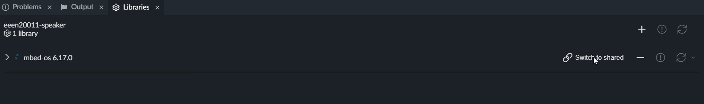
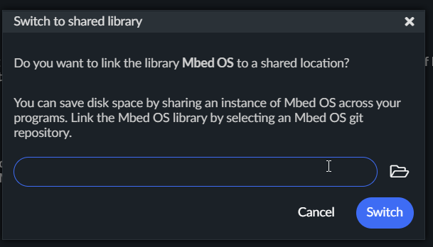
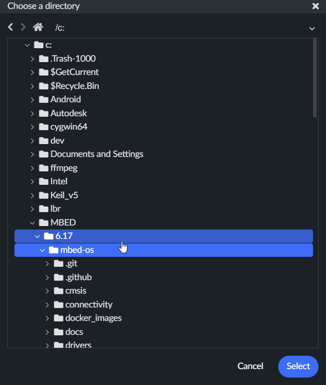
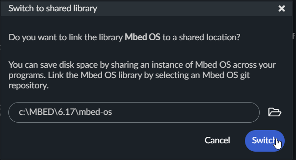

# mbed-stm32

template with preconfigured rules for code styling etc

set target for the stm32f401re nucleo board to

NUCLEO-F401RE

## Guide: Changing to a shared instance.

By default, we use a local instance of mbed os initialized via git. This can be done via the git submodules feature or via mbed studio ('fix problems' in library tab).
1. `git submodule init` - Clones submodules according to the `.gitmodules` file
2. `git submodule update` - Fetches all data and checks out the relevant commit.

Alternatively, you can used a share instance. (highly reccomended, especially if you have many instances of Mbed OS, which if you are using this repo often, you will do so)

I would put your shared instances somewhere easily accessible. For example, on Windows, you might want to put a folder structure in the C:\ directory, but you can do it wherever as long as its accessible.

```
cd C:\
mkdir MBED
mkdir .\MBED\6.17
cd .\MBED\6.17
git clone https://github.com/ARMmbed/mbed-os.git
cd .\mbed-os\
git checkout 17dc3dc2e6e2817a8bd3df62f38583319f0e4fed
```

You could similarly do this with other editions of Mbed os, such as older/newer versions. The specific git commit hash we used here correlates to the release of 6.17. You should also be able to use the CE edition of Mbed if you are so inclined.





### extra: git
`git checkout <commit>` will detach the head to a specific commit. the head is the working place of your repo, but when it is checked out to a commit, is it no longer attached to a particular branch. In short, it means that the git history can easily be lost if changes are added, unless you happened to remember the commit hash (the long string)

## other ideas

Visual studio code is certainly possible but troublesome. neither clangd nor intellisense seem to do a good enough job of handling mbed.

Never use keil studio. Only use mbed studio. Keil Studio will make debugging annoying. Install mbed studio with the st-link drivers and just use standard debug tools
